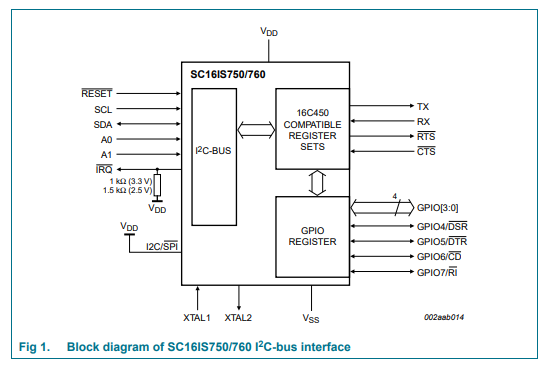
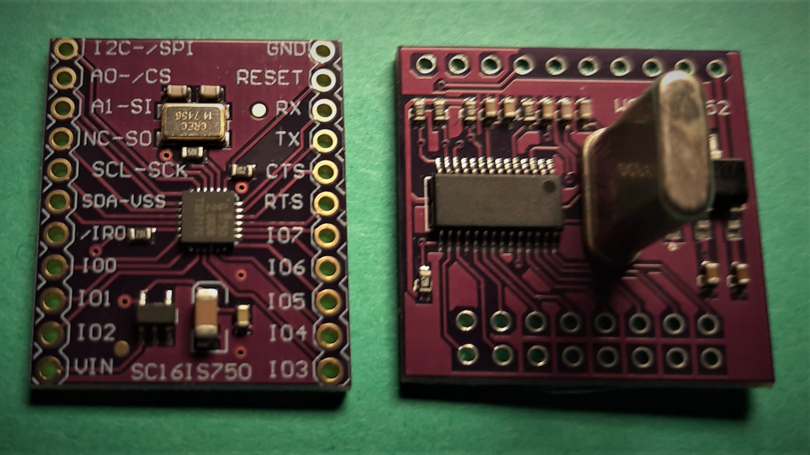

SC16IS750 UART / IO Expander
============================

.. TODO need to make a very compressed image for TOC
.. seo::
    :description: Instructions for setting up SC16IS750 I²C Bridge in ESPHome.
    :image: sdp31.jpg

.. role:: raw-html-m2r(raw)
   :format: html

The SC16IS750 component allows you to use SC16IS750
(`Datasheet <https://www.nxp.com/docs/en/data-sheet/SC16IS740_750_760.pdf>`__)
or SC16IS752 (`Datasheet <https://www.nxp.com/docs/en/data-sheet/SC16IS752_SC16IS762.pdf>`__)
Bridges chip/breakboards in ESPHome. 

The SC16IS750 is a slave I²C chip that provides a single-channel high
performance UART while the SC16IS752 provides a dual-channel UART. 
Both offers data rates up to 5 Mbit/s and guarantees low operating and
sleeping current. They also provides 8 additional programmable I/O pins and
additional advanced features such as auto
hardware and software flow control, automatic RS-485 support, and software reset. 

You can buy breakout boards that have these chips already installed
`SC16IS750 <https://www.aliexpress.com/premium/sc16is750-board.html>`__
and `SC16IS752 <https://www.aliexpress.com/premium/sc16is752-board.html>`__

.. note:: 
  A SC16IS750 breakout board is equipped with a MIC5219 LG33 voltage regulator, 
  which provides 3.3V to the chip and a 14.7456MHz crystal.\ :raw-html-m2r:` `
  A SC16IS752 breakout board is equipped with a AMS1117-3.3 voltage regulator, 
  which provides 3.3V to the chip and a 1.8432Mhz crystal.\ :raw-html-m2r:` `

.. warning:: 
  **Due to the fact that these boards are equipped with voltage regulator you must power 
  power them 5v (3.3v won't work)**. \ :raw-html-m2r:` `
  The level of i2c pins is 3.3V, but all pins are 5V tolerant.

  sc16is750 and sc16is752 boards

.. note:: 
  The range of possible addresses for these boards are ``0x90`` to ``0xAE``.
  The actual choice of  depends on state of the 2 address pins A0-A1. 
  Please see the table below to set the I²C device address for the boards.
  A mixture of **up to sixteen** of these boards can reside on the same I²C bus.

  Once configured, you can use any of the UART channels (2 for SC16IS752
  board) for your projects. Each channel acts for the connected components as a 
  virtual UART Bus. You can also use any of the 8 GPIO pins (pin number   0-7). 
  Any option accepting a :ref:`Pin Schema <config-pin_schema>` can theoretically 
  be used, but some more complicated components that do communication through 
  this I/O expander will not work.

.. list-table::
   :header-rows: 1
   :width: 300px
   :align: left

   * - I²C address
     - A1
     - A0
   * - 0x90
     - VDD
     - VDD
   * - 0x92
     - VDD
     - VSS
   * - 0x94
     - VDD
     - SCL
   * - 0x96
     - VDD
     - SCA
   * - 0x98
     - VSS
     - VDD
   * - 0x9A
     - VSS
     - VSS
   * - 0x9C
     - VSS
     - SCL
   * - 0x9E
     - VSS
     - SDA
   * - 0xA0
     - SCL
     - VDD
   * - 0xA2
     - SCL
     - VSS
   * - 0xA4
     - SCL
     - SCL
   * - 0xA6
     - SCL
     - SDA
   * - 0xA8
     - SDA
     - VDD
   * - 0xAA
     - SDA
     - VSS
   * - 0xAC
     - SDA
     - VSS
   * - 0xAE
     - SDA
     - SDA

.. code-block:: yaml

    # Example configuration entry
    sc16is750:
      - address: 0x90
        id: bridge_0
        i2c_id: i2c_bus
        board: sc16is752
        channels: 
          - uart_id: uart_0
            channel: 0
            baud_rate: 9600
            data_bits: 8
          - uart_id: uart_1
            channel: 1
            baud_rate: 19200

    # Individual outputs
    switch:
      - platform: gpio
        name: "Bridge 0 Pin #0"
        pin:
          sc16is750: bridge_0
          # Use pin number 0
          number: 0
          # One of INPUT or OUTPUT
          mode:
            output: true
          inverted: false
    
    # Individual uart Devices
    sensor:
      - platform: pmsx003
        uart_id: uart_1
        type: PMSX003
        pm_1_0:
          name: "PM <1.0µm Concentration"

Component configuration variables:
**********************************

- **id** (**Required**, :ref:`config-id`): The id to use for this SC16IS750 component.
- **address** (*Optional*, int): The I²C address of the bridge.
  Defaults to ``0x90``.
- **i2c_id** (*Optional*): The I²C Bus ID
  Defaults to ``false`` 
- **channels** (*Optional*): The I²C Bus Channels

  - **uart_id** (**Required**, :ref:`config-id`): The id to use for this virtual Uart Bus.
  - **channel** (**Required**): The channel (0-7) to use for this virtual I2C Bus.
  - **baud_rate** (**Required**, int): The baud rate of the UART bus.
  - **data_bits** (*Optional*, int): The number of data bits used on the UART bus. Options: 5 to 8. Defaults to 8.
  - **parity** (*Optional*): The parity used on the UART bus. Options: ``NONE``, ``EVEN``, ``ODD``. Defaults to ``NONE``.
  - **stop_bits** (*Optional*, int): The number of stop bits to send. Options: 1, 2. Defaults to 1.

Pin configuration variables:
****************************

- **sc16is750** (**Required**, :ref:`config-id`): The id of the ``SC16IS750`` component of the pin.
- **number** (**Required**, int): The pin number.
- **inverted** (*Optional*, boolean): If all read and written values
  should be treated as inverted. Defaults to ``false``.
- **mode** (*Optional*, string): A pin mode to set for the pin at. One of ``INPUT`` or ``OUTPUT``. 

See Also
********

- :ref:`i2c`
- :doc:`switch/gpio`
- :doc:`binary_sensor/gpio`
- `SC16IS750 datasheet <https://www.nxp.com/docs/en/data-sheet/SC16IS740_750_760.pdf>`__
- `SC16IS752 datasheet <https://www.nxp.com/docs/en/data-sheet/SC16IS752_SC16IS762.pdf>`__
- :apiref:`sc16is750/sc16is750.h`
- :ghedit:`Edit`
