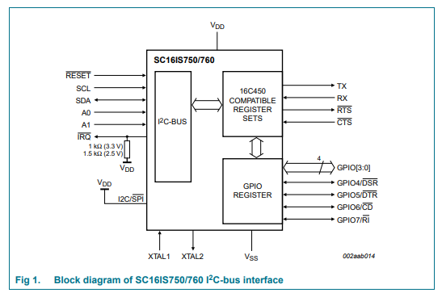
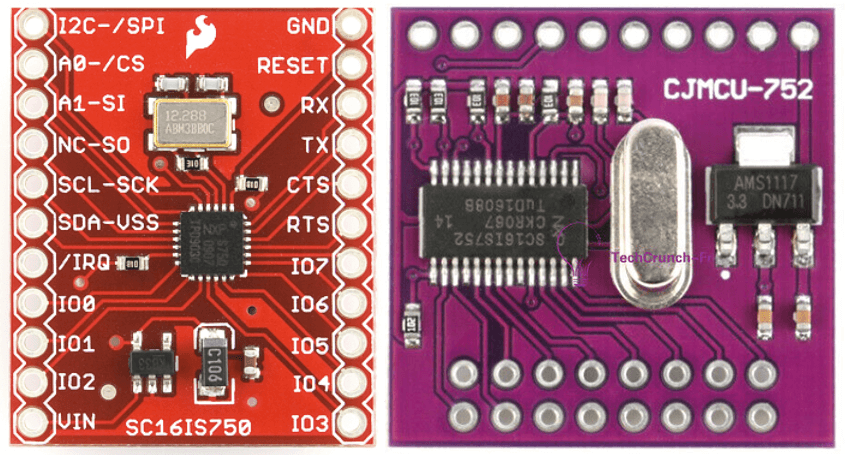

SC16IS75X I²C UART & IO Expander
================================

.. seo::
    :description: Instructions for setting up SC16IS75X I²C Component in ESPHome.
    :image: sc16is75x.png

.. role:: raw-html-m2r(raw)
   :format: html

The SC16IS75X component allows you to use either SC16IS750
(`Datasheet <https://www.nxp.com/docs/en/data-sheet/SC16IS740_750_760.pdf>`__)
or SC16IS752 (`Datasheet <https://www.nxp.com/docs/en/data-sheet/SC16IS752_SC16IS762.pdf>`__)
chips or breakout boards in ESPHome. 

The SC16IS750 is a slave I²C chip that provides a single-channel 
UART and 8 additional programmable GPIO pins. The SC16IS752 provides a dual-channel UART 
and 8 additional programmable GPIO pins. 

The breakout-boards can be found in many places for example at
`SC16IS750 board <https://www.aliexpress.com/premium/sc16is750-board.html>`__
and `SC16IS752 board <https://www.aliexpress.com/premium/sc16is752-board.html>`__

.. note:: 
  A SC16IS750 breakout board is equipped with a MIC5219 LG33 voltage regulator, 
  which provides 3.3 V to the SC16IS750 chip and has a 14.7456MHz crystal.\ :raw-html-m2r:` `
  A SC16IS752 breakout board is equipped with a AMS1117-3.3 voltage regulator, 
  which provides 3.3 V to the SC16IS752 chip and has a 3.072Mhz crystal.\ :raw-html-m2r:` `

.. warning:: 
  **Due to the fact that these boards are equipped with a voltage regulator it is advised to 
  power them with 5 V**. \ :raw-html-m2r:` `
  The level of i2c pins is 3.3 V, but all pins are 5 V tolerant.

  SC16IS750 and SC16IS752 Breakout boards

.. note:: 
  The range of possible addresses for these boards is ``0x48`` to ``0x57``.
  The address value depends on state of the 2 address pins A0-A1. 
  The table below show how to connect the A0-A1 pins to set the I²C device 
  address of the boards. A mixture of **up to sixteen** of these boards 
  can therefore reside on the same I²C bus.

.. list-table::
   :header-rows: 1
   :width: 300px
   :align: center

   * - I²C address
     - A1
     - A0
   * - 0x48
     - VDD
     - VDD
   * - 0x49
     - VDD
     - VSS
   * - 0x4A
     - VDD
     - SCL
   * - 0x4B
     - VDD
     - SCA
   * - 0x4C
     - VSS
     - VDD
   * - 0x4D
     - VSS
     - VSS
   * - 0x4E
     - VSS
     - SCL
   * - 0x4F
     - VSS
     - SDA
   * - 0x50
     - SCL
     - VDD
   * - 0x51
     - SCL
     - VSS
   * - 0x52
     - SCL
     - SCL
   * - 0x53
     - SCL
     - SDA
   * - 0x54
     - SDA
     - VDD
   * - 0x55
     - SDA
     - VSS
   * - 0x56
     - SDA
     - VSS
   * - 0x57
     - SDA
     - SDA

.. warning:: 
  Personally I have not been able to change the address of the boards. Whatever signal I apply
  to the pins A0, A1 the address is always equal to 0x5D (A0=A1=VSS) ?

Once configured, you can use any of the UART channels (2 for SC16IS752
board) in your device. Each channel acts for the connected components as a 
virtual UART Bus. You can also use any of the 8 GPIO pins (pin number ``0-7``). 
Any option accepting a :ref:`Pin Schema <config-pin_schema>` can theoretically 
be used, but some more complicated components that do communication through 
this I/O expander will not work.

.. code-block:: yaml

    # Example configuration entry
    uart:
      id: dummy
      tx_pin: 3
      baud_rate: 9600
    i2c:
      sda: 21 # 5
      scl: 22 # 4
      id: i2c_bus

    sc16is75x:
      - address: 0x4D
        id: i2c_bridge_0
        i2c_id: i2c_bus
        model: sc16is752
        uart: 
          - uart_id: uart_0
            channel: 0
            baud_rate: 192000
            data_bits: 7
            parity: even
          - uart_id: uart_1
            channel: 1
            baud_rate: 19200

    # Individual binary_sensor inputs
    binary_sensor:
      - platform: gpio
        name: "Bridge 0 Pin #0"
        pin:
          sc16is75x: i2c_bridge_0
          number: 0
          mode:
            input: true
          inverted: true

    # Individual binary outputs
    switch:
      - platform: gpio
        name: "Bridge 0 Pin #1"
        pin:
          sc16is75x: i2c_bridge_0
          number: 1
          mode:
            output: true
          inverted: false

    # Device using one of the sc16is75x Uart channel
    sensor:
      - platform: pmsx003
        uart_id: uart_1
        type: PMSX003
        pm_1_0:
          name: "PM <1.0µm Concentration"

.. caution:: 
  Currently, due to some internal limitation, it is necessary to declare a ``uart:`` component in
  your configuration **even if you do not need one**. See the example above. This requirement 
  might disappear in the future.

Choosing an I²C to UART components
**********************************
There are two components in the ESPHome library that allow you to add a number 
of UART channels from an I2C bus. This allows you to connect a large number of 
devices that communicate with rs232 interface via a single I²C bus. 
These two components are

- The sc16is75x component, which lets you use sc16is750 chips 
  or breakbooards, as well as sc16is752 chips and breakboards. 
  Up to 4 of these boards can be on an I²C bus simultaneously.
- The wk2132 component, which lets you use wk2132 chips or 
  DFRobot `Gravity: I²C to Dual UART Module. <https://www.dfrobot.com/product-2001.html>`__ 
  Up to 4 of these boards can be on an I²C bus simultaneously.

The following table compares the characteristics of these different components to help 
you choose the most suitable one for your application.

.. list-table::
   :header-rows: 1
   :width: 400px
   :align: center

   * - 
     - SC16IS750
     - SC16IS752
     - WK2132
   * - Power_supply
     - 5 V (1)
     - 5 V (1)
     - 3.3 V
   * - Max_UARTs
     - 16
     - 16 x 2
     - 4 x 2
   * - Word_length
     - 6-8
     - 6-8
     - 8
   * - Parity
     - Odd/Even/None
     - Odd/Even/None
     - Odd/Even/None
   * - FIFO
     - 64 (2)
     - 64 (2)
     - 256 (2)

(1) Boards based on SC16IS75X have a voltage regulator and are normally 
    designed for 5 V power supply. However, experience has shown that they 
    work correctly with a 3.3 V power supply.
(2) If the component is used correctly, the size of the FIFO 
    is not irrelevant. However, a larger FIFO size provides a certain 
    safety margin.

Component configuration variables:
**********************************

- **id** (**Required**, :ref:`config-id`): The id to use for this SC16IS75X component.
- **address** (*Optional*): The I²C address of this component. Defaults to ``0x48``.
- **i2c_id** (*Optional*): The I²C Bus ID. Defaults to the default I²C bus.
- **model** (*Optional*): The board's model: ``sc16is750``, or ``sc16is752``). Defaults to ``sc16is752``.
- **crystal** (*Optional*): The frequency in Hz of the crystal connected to the chip.
  If you are using one of the breakout boards described above, the frequency of the crystal 
  does not need to be specified. For a sc16is750 board, the crystal will be set to 14745600
  and for a sc16is752 board the crystal will be set to 3072000. If you are building your own board,
  you need to specify the value of the crystal connected to the chip.
- **uart** (*Optional*): The UART Buses. This optional parameter must be specified if you want
  to use the UART functionality of the component.

  - **uart_id** (**Required**, :ref:`config-id`): The id to use for this virtual UART Bus.
  - **channel** (*Optional*): The channel number to use for this virtual UART Bus. Default to ``0``.
    A sc16is750 has only one channel ``0`` and therefore in that case you do not need to specify it.
    A sc16is752 has two possible channels and therefore in that case if you use the channel 1 it needs
    to be specified. Obviously if you are using both channels, they must use different channel numbers 
    (i.e. ``0`` and ``1``)
  - **baud_rate** (**Required**): The baud rate of the UART bus.
  - **data_bits** (*Optional*): The number of data bits used on the UART bus. Options: ``5`` to ``8``. Defaults to ``8``.
  - **parity** (*Optional*): The parity used on the UART bus. Options: ``NONE``, ``EVEN``, ``ODD``. Defaults to ``NONE``.
  - **stop_bits** (*Optional*): The number of stop bits to send. Options: ``1``, ``2``. Defaults to ``1``.

.. warning:: 
  It seems that some older sc16750 breakout boards used a different crystal. Therefore check 
  carefully the value of the crystal and if it is different from the default specified above use the 
  **crystal** configuration variable

Pin configuration variables:
****************************

- **sc16is75x** (**Required**, :ref:`config-id`): The id of the ``SC16IS75X`` component of the pin.
- **number** (**Required**): The pin number (``0`` to ``7``)
- **inverted** (*Optional*): If all read and written values should be treated as inverted. Defaults to ``false``.
- **mode** (*Optional*): A pin mode to set for the pin at. One of ``INPUT`` or ``OUTPUT``. Default to ``INPUT``

See Also
********

- :ref:`i2c`
- :doc:`switch/gpio`
- :doc:`binary_sensor/gpio`
- `SC16IS750 datasheet <https://www.nxp.com/docs/en/data-sheet/SC16IS740_750_760.pdf>`__
- `SC16IS752 datasheet <https://www.nxp.com/docs/en/data-sheet/SC16IS752_SC16IS762.pdf>`__
- :apiref:`sc16is75x/sc16is75x.h`
- :ghedit:`Edit`

