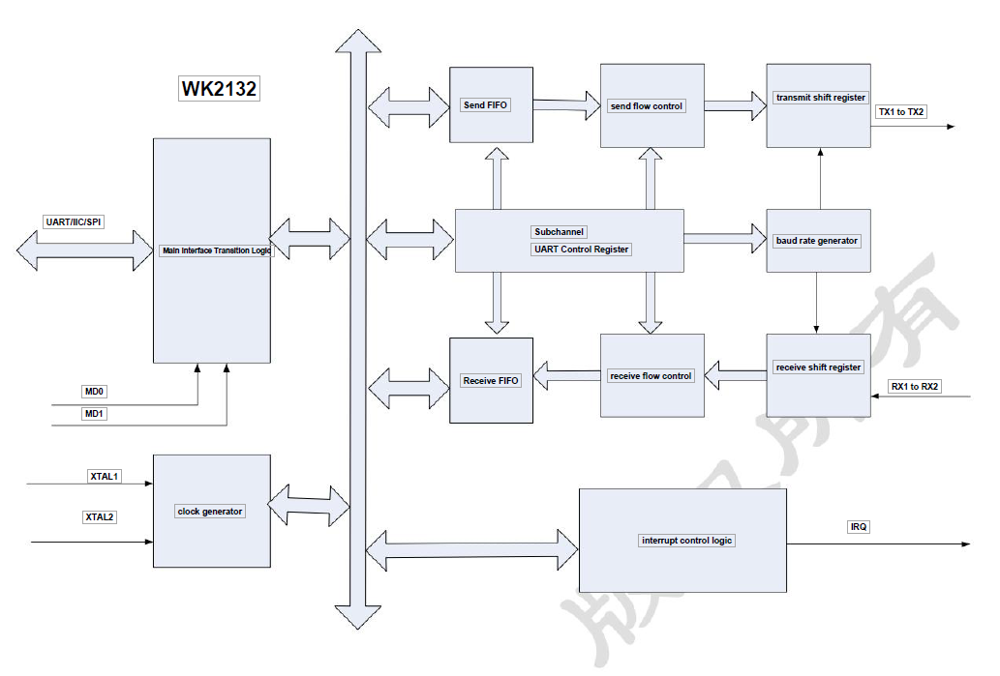
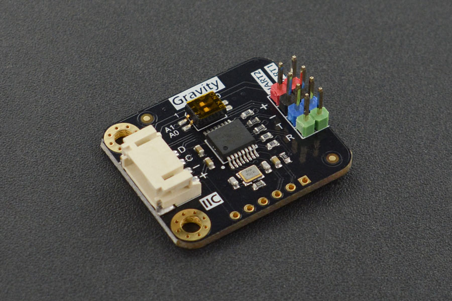

WK2132 I²C to UART Expander
===========================

.. seo::
    :description: Instructions for setting up WK2132 I²C Component in ESPHome.
    :image: DFR0627.jpg

.. role:: raw-html-m2r(raw)
   :format: html

The WK2132 component allows you to use the 
`Weika WK2332-ISSG <https://www.lcsc.com/product-detail/Interface-Specialized_WEIKAI-WK2132-ISSG_C401039.html>`__
chip or the DFROBOT `Gravity: I²C to Dual UART Module <https://www.dfrobot.com/product-2001.html>`__
module directly in ESPHome. 

This WK2132 chip/module is an I²C to Dual UART with data transmission rate up to 1Mbps. Each UART channel has independent 
256-byte FIFO hardware buffer for transmitting and receiving. The baud rate, word length, and check format of every 
UART channel can be set independently. The module provides 2Mbps maximum communication rate. \ :raw-html-m2r:` `
Documentation about the DFRobot module can be found at the 
`DFROBOT Wiki <https://wiki.dfrobot.com/Gravity%3A%20IIC%20to%20Dual%20UART%20Module%20SKU%3A%20DFR0627>`__

.. .. figure:: images/dfrobot-wk2132.png
..   :align: center

.. note:: 
  At most four such modules can be connected onto one I²C controller board to expand 8 
  hardware serial ports. The range of possible addresses for these boards are 
  ``0x??`` to ``0x??``. The actual choice of  depends on state of A0 and A1. \ :raw-html-m2r:` `
  Once configured, you can use any of the UART channels to connect your UART Devices. 
  Each channel acts for the connected component as a virtual UART Bus. 

.. list-table::
   :header-rows: 1
   :width: 300px
   :align: left

   * - I²C address
     - A1
     - A0
   * - 0x48
     - 0
     - 0
   * - 0x49
     - 0
     - 1
   * - 0x4A
     - 1
     - 0
   * - 0x4B
     - 1
     - 1

Address table

.. code-block:: yaml

    # Example configuration entry
    wk2132:
      - address: 0x??
        id: bridge_0
        i2c_id: i2c_bus
        crystal: 3027000
        uart: 
          - uart_id: uart_0
            channel: 0
            baud_rate: 9600
            data_bits: 7
            parity: even
          - uart_id: uart_1
            channel: 1
            baud_rate: 19200

    # Device using one of the wk2132 Uart channel
    sensor:
      - platform: pmsx003
        uart_id: uart_0
        type: PMSX003
        pm_1_0:
          name: "PM <1.0µm Concentration"

Component configuration variables:
**********************************

- **id** (**Required**, :ref:`config-id`): The id to use for this WK2312 component.
- **address** (*Optional*): The I²C address of this component. Defaults to ``0x??``.
- **i2c_id** (*Optional*): The I²C Bus ID. Defaults to the default i²c bus.
- **crystal** (*Optional*): The frequency in Hz of the crystal connected to the chip.
  If you are using DFROBOT module, the frequency of the crystal  does not need to be specified. 
  it will be set automatically to 14745600 Hz.
- **uart** (*Optional*): The UART Buses. This optional parameter must be specified if you want
  to use the UART of the component.

  - **uart_id** (**Required**, :ref:`config-id`): The id to use for this virtual UART Bus.
  - **channel** (*Optional*): The channel number to use for this virtual UART Bus. Default to ``0``.
    Obviously if you are using both channels they must use different channel number (i.e. ``0`` and ``1``)
  - **baud_rate** (**Required**): The baud rate of the UART bus.
  - **data_bits** (*Optional*): The number of data bits used on the UART bus. Options: ``5`` to ``8``. Defaults to ``8``.
  - **parity** (*Optional*): The parity used on the UART bus. Options: ``NONE``, ``EVEN``, ``ODD``. Defaults to ``NONE``.
  - **stop_bits** (*Optional*): The number of stop bits to send. Options: ``1``, ``2``. Defaults to ``1``.

See Also
********

- :ref:`i2c`
- :ghedit:`Edit`
