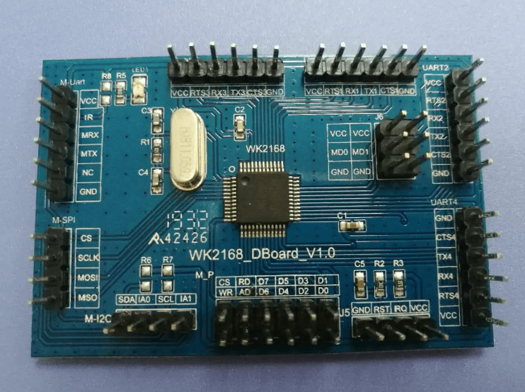

WK2168 SPI/I²C Quad UART& GPIO Expander
=======================================

.. seo::
    :description: Instructions for setting up WK2168 SPI/I²C to UART Component in ESPHome.
    :image: wk2168.jpg
    :keywords: WK2168, UART, SPI, I²C
    
.. _wk2168-component:

.. role:: raw-html-m2r(raw)
   :format: html

The ``WK2168`` SPI/I²C component allows you to connect a 
`Weika WK2332-ISSG chip. <https://jlcpcb.com/partdetail/WEIKAI-WK2168IQPG/C401041>`__
to an ESP micro controller through a SPI or an I²C bus

It can also be used with evaluation board equipped with this chip, such as:
`WK2168 Chip Development Board. <https://fr.aliexpress.com/item/1005002198759633.html>`__

The WK2168 chip/module acts as an SPI/I²C to **Quad UART** and **GPIO pins** expander. 
Each UART channel has two independent 256-byte FIFO hardware buffers to transmit and 
receive and support data transmission rates up to 1 Mbps. \ :raw-html-m2r:` `
It's worth noting that the baud rate and parity format of each UART channel can be 
configured independently. However, the data bit length is fixed at 8 and cannot be changed. 
Utilizing the UART channels enables you to connect your UART devices, with each channel functioning 
as a virtual UART bus for the connected component. \ :raw-html-m2r:` `

Component bus
-------------

You can connect the board/chip to the micro-controller either through an :ref:`I²C <i2c>` 
bus or an :ref:`SPI <spi>` bus as described below:

Over SPI
--------

The ``wk2168_spi`` component allows you to use the WK2168 expander with ESPHome via 
a :ref:`SPI <spi>` bus. You can connect several of these modules to a single SPI controller 
circuit effectively expanding the number of hardware serial ports available. Each WK2168 
module needs to be selected individually with a separate CS.

.. code-block:: yaml

    # Example of configuration entry
    spi:

    wk2168_spi:
      - id: wk2168_bridge_spi
        cs_pin: 5
        uart:
          - uart_id: spi_uart_0
            channel: 0
            baud_rate: 128200
            parity: even
          - uart_id: spi_uart_1
            channel: 1
            baud_rate: 19200
          - uart_id: spi_uart_2
            channel: 2
            baud_rate: 9600
          - uart_id: spi_uart_3
            channel: 3
            baud_rate: 19200

Configuration variables:
************************

- **id** (**Required**, :ref:`config-id`): The id to use for this WK2312 component.
- **spi_id** (*Optional*, :ref:`config-id`): Manually specify the ID of the :ref:`SPI Component <spi>` if you want
  to use multiple SPI buses.
- **cs_pin** (**Required**, :ref:`Pin Schema <config-pin_schema>`): The pin on the ESP that the chip select line
  of the wk2168 is connected to.
- **data_rate** (*Optional*): Set the data rate of the controller. One of ``80MHz``, ``40MHz``, ``20MHz``, ``10MHz``,
  ``5MHz``, ``4MHz``, ``2MHz``, ``1MHz`` (default), ``200kHz``, ``75kHz`` or ``1kHz``. A numeric value in Hz can 
  alternatively be specified.
- **crystal** (*Optional*): The frequency in Hz of the crystal connected to the chip.
  The default value is 14745600 Hz.
- **uart** (*Req
uired*): The UART channels.

  - **uart_id** (**Required**, :ref:`config-id`): The id to use for this UART channel.
  - **channel** (**Required**): The channel number to use for this virtual UART. Options: 
    ``0``, ``1``, ``2``, ``3``. Obviously each channel must use a different channel number.
  - **baud_rate** (**Required**): The baud rate of the UART channel.
  - **parity** (*Optional*): The parity used on the UART channel. Options: ``NONE``, ``EVEN``, 
    ``ODD``. Defaults to ``NONE``.
  - **stop_bits** (*Optional*): The number of stop bits to send. Options: ``1``, ``2``. 
    Defaults to ``1``.

Over I²C
--------

The ``wk2168_i2c`` component allows you to use the WK2168 expander with ESPHome using an I²C bus. 
Up to four such modules can be connected to an I²C controller board, effectively expanding the 
available hardware serial ports to **16**. The base addresses of these boards are defined by the 
positions of two switches, A0 and A1, on the board.

..  list-table:: wk2168 address selection
    :header-rows: 1
    :width: 350px
    :align: center

    * - I²C address
      - A1
      - A0
    * - 0x10 - 0x17
      - 0
      - 0
    * - 0x30 - 0x37
      - 0
      - 1
    * - 0x50 - 0x57
      - 1
      - 0
    * - 0x70 - 0x77
      - 1
      - 1

.. important:: 

    Note that the address is given as a **range** a not a number as you usually find on other I²C component.
    Indeed due to a peculiar way of addressing the different internal registers each wk2168 component actually occupy 
    8 consecutive addresses. For example if the component base address is 0x10, it will occupy the addresses ranging from 
    0x10 to 0x17 on the I²C bus. \ :raw-html-m2r:` `
    This is important to know if you want to connect other devices on the same I²C bus.

.. code-block:: yaml

    # Example of configuration entry
    wk2168_i2c:
      - address: 0x70
        id: bridge_0
        uart:
          - uart_id: i2c_uart_0
            channel: 0
            baud_rate: 9600
            parity: even
          - uart_id: i2c_uart_1
            channel: 1
            baud_rate: 19200
          - uart_id: i2c_uart_2
            channel: 2
            baud_rate: 9600
          - uart_id: i2c_uart_3
            channel: 3
            baud_rate: 19200

Configuration variables:
************************

- **id** (**Required**, :ref:`config-id`): The id to use for this WK2312 component.
- **address** (*Optional*): The I²C address of this component. Defaults to ``0x10``.
- **i2c_id** (*Optional*): The I²C Bus ID. Defaults to the default i²c bus.
- **crystal** (*Optional*): The frequency in Hz of the crystal connected to the chip.
  The default value is 14745600 Hz.
- **uart** (*Required*): The UART channels.

  - **uart_id** (**Required**, :ref:`config-id`): The id to use for this UART channel.
  - **channel** (**Required**): The channel number to use for this virtual UART. Options: 
    ``0``, ``1``, ``2``, ``3``. Obviously if you are using several channels 
    they must have different channel number.
  - **baud_rate** (**Required**): The baud rate of the UART channel.
  - **parity** (*Optional*): The parity used on the UART channel. Options: ``NONE``, ``EVEN``, 
    ``ODD``. Defaults to ``NONE``.
  - **stop_bits** (*Optional*): The number of stop bits to send. Options: ``1``, ``2``. 
    Defaults to ``1``.

Performance considerations:
---------------------------

Please be aware that the communication between the wk2168 device and the processor occurs on an external bus, 
with a relatively low default operating frequency. Therefore tasks such as checking the status of the chip's 
registers or transferring bytes from the internal FIFOs to the processor may experience delays. \ :raw-html-m2r:` `
To improve this, it is strongly recommended to increase the bus frequency. 

- With a SPI bus this can be done on the wk2168_spi component by specifying `data_rate`:

.. code-block:: yaml

    wk2168_spi:
      - id: wk2168_bridge_spi
        spi_id: spi_bus_id
        cs_pin: 5
        data_rate: 4MHz

- With an I²C bus this needs to be done on the `i2c` declaration and therefore will
  apply to all components connected to this bus.

.. code-block:: yaml

    i2c:
      sda: 21
      scl: 22
      scan: true
      id: bus_i2c
      frequency: 800kHz

See Also
--------

- :ref:`i2c`
- :ref:`spi`
- :apiref:`wk2168/wk2168.h`
- :apiref:`wk2168_spi/wk2168_spi.h`
- :apiref:`wk2168_i2c/wk2168_i2c.h`
- :ghedit:`Edit`
